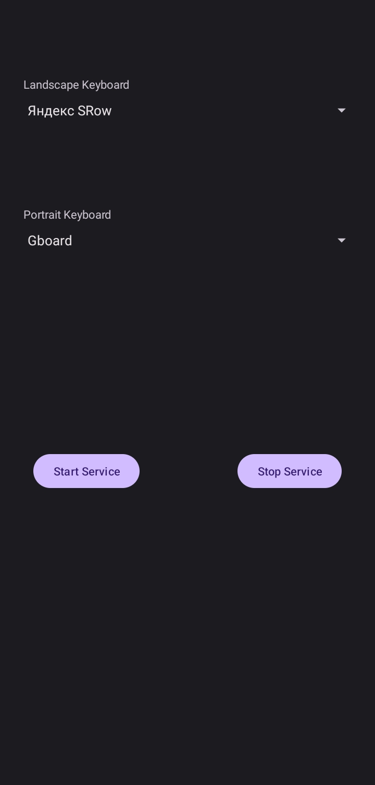

## Android Keyboard Helper
Changes default input method based on screen orientation.



### Giving 'android.permission.WRITE_SECURE_SETTINGS' permission
```
adb shell "su -c 'pm grant com.zhymabekroman.keyboardhelper android.permission.WRITE_SECURE_SETTINGS'"
```
